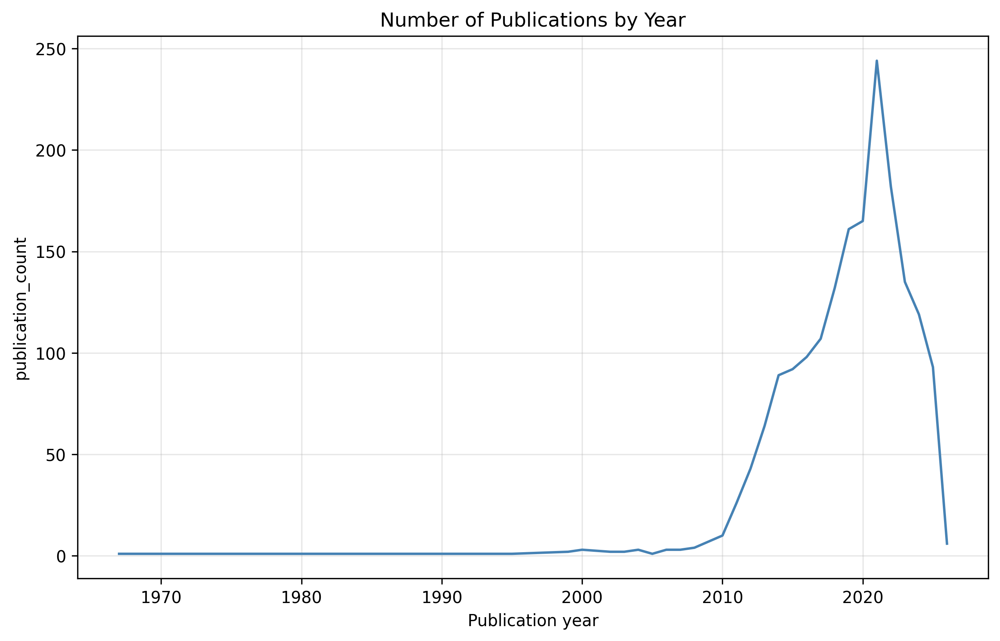
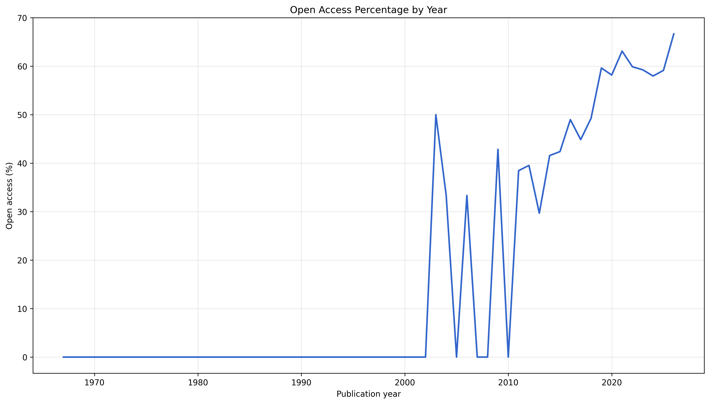
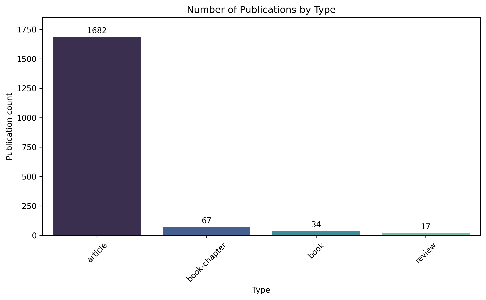
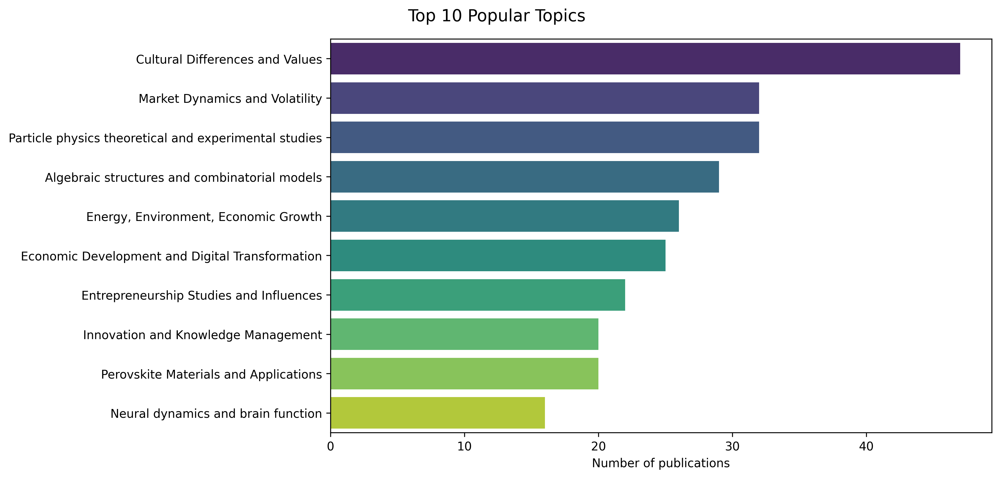

# OpenAlex Research Analysis 

 
 
 
 
 

В рамках проекта из API OpenAlex извлекаются данные, имеющие отношение к НИУ "Высшая школа экономики" (HSE, Higher School of Economics). После этого выполняется предварительная обработка данных, проводится разведочный анализ данных с использованием библиотеки pandas и строятся визуализации с помощью Seaborn и Matplotlib. Результаты анализа экспортируются в CSV-файлы и графики.

## Возможности 
- загрузка данных из OpenAlex API 
- предварительная обработка данных 
- разведочный анализ данных (EDA) 
- визуализация результатов 
- экспорт результатов в CSV и PNG

## Структура проекта 
```text
openalex-research-analysis/  
├── data/  
│   ├── raw.json                    
│   └── processed.csv              
│  
├── results/  
│   ├── csv/  
│   │   ├── authors_dynamic.csv  
│   │   ├── most_cited_publications.csv  
│   │   ├── most_popular_keywords.csv  
│   │   ├── most_popular_themes.csv  
│   │   ├── open_access_statistics.csv  
│   │   ├── publication_types.csv  
│   │   ├── publications_by_type.csv  
│   │   └── publications_by_year.csv  
│   │  
│   └── graphs/  
│       ├── most_popular_themes_graph.png  
│       ├── number_of_publications_by_year_graph.png  
│       ├── open_access_statistics_graph.png  
│       └── publication_types_graph.png  
│  
├── src/  
│   ├── __init__.py
│   ├── analysis.py                 
│   ├── constants.py                
│   ├── parser.py                   
│   ├── processing.py              
│   └── visualisation.py            
│  
├── main.py                         
├── requirements.txt                
├── README.md                     
└── .gitignore                      
```

## Используемые библиотеки  
| Библиотека | Назначение |
|------------|------------|
| [pandas](https://pandas.pydata.org/docs/) | обработка и анализ данных |
| [matplotlib](https://matplotlib.org/stable/index.html) | построение графиков |
| [seaborn](https://seaborn.pydata.org/) | визуализация данных |
| [requests](https://requests.readthedocs.io/en/latest/index.html) | работа с OpenAlex API |
| [urllib.parse](https://docs.python.org/3/library/urllib.parse.html#module-urllib.parse) | обработка URL |
| [logging](https://docs.python.org/3/library/logging.html) | логирование ошибок |
| [typing](https://docs.python.org/3/library/typing.html) | аннотации типов |
| [json](https://docs.python.org/3/library/json.html) | чтение и запись JSON |
| [os](https://docs.python.org/3/library/os.html) | работа с файловой системой |
| [sys](https://docs.python.org/3/library/sys.html) | завершение программы |

## Запуск
1. Клонирование репозитория: 
```bash
git clone git@github.com:progen1tor/openalex-research-analysis.git
cd openalex-research-analysis
```

2. Установка зависимостей: 
```bash
pip install -r requirements.txt
```

3. Запуск проекта: 
```bash 
python main.py 
```

## Примеры результатов 

### Number of Publications by Year



### Open Access Percentage



### Publication Types



### Top 10 Popular Topics



## Контакты 
Telegram: [@ob1101](https://t.me/ob1101)